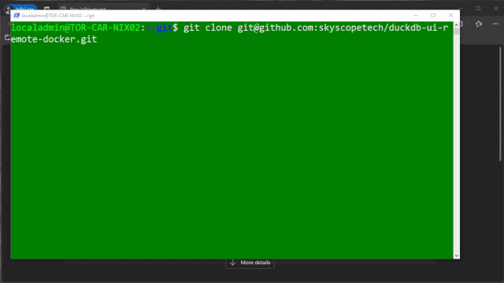

# DuckDB UI Remote

A Docker container that provides secure remote access to the DuckDB UI through HAProxy with SSL termination.

<!-- ./docs/demo.gif -->



## Security Considerations

- The container runs as root, which may expose your system to security risks
- DuckDB UI was designed for use on localhost, likely to prevent unauthorized access to your data
- Running the container and accessing it over the public web may expose your data to unauthorized actors
- The HAProxy configuration modifies request headers to bypass the DuckDB UI's localhost restriction, essentially bypassing the security measure

## Overview

This project containerizes the DuckDB UI and makes it accessible via HTTPS using HAProxy as a reverse proxy. The setup:

- Runs the DuckDB UI in a container
- Configures HAProxy to handle incoming connections
- Uses a self-signed SSL certificate for HTTPS connections
- Modifies request headers for compatibility with DuckDB UI

## Prerequisites

- Docker
- Docker Compose

## Running the Container

1. Clone this repository:

   ```bash
   git clone https://github.com/skyscopetech/duckdb-ui-remote-docker.git
   cd duckdb-ui-remote
   ```

2. Build and start the container:

   ```bash
   docker compose up -d
   ```

3. Access the DuckDB UI in your browser at `https://{your-machine-host}:8443`.

Note: Your browser will show a security warning because of the self-signed certificate. You'll need to accept this exception to proceed.
